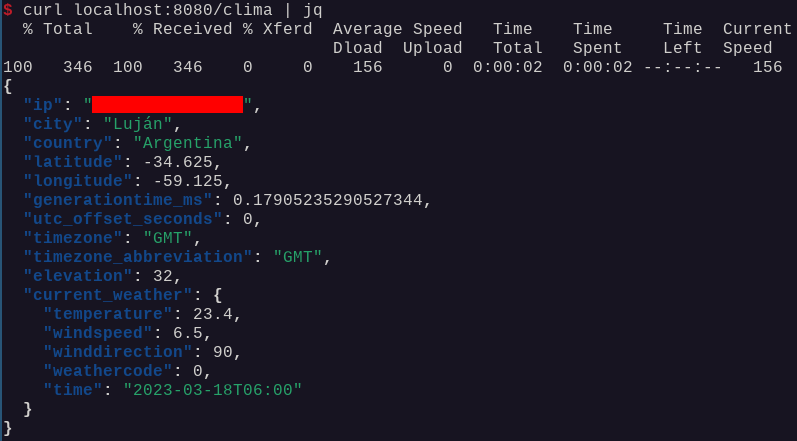

# Ejercicio 5  

## Software utilizado

+ Debian 11 (bulseye), versión 5.10.0-21-amd64.
+ Maven 4.0.0-alpha-5.
+ JDK 19.0.1.
+ Docker 23.0.1.

## Cómo poner en funcionamiento el servidor

Ejecutar desde una terminal el siguiente comando:

```sh
docker run -p 8080:80 facundol/tp1-ej5
```

**_Nota:_** se puede reemplazar el puerto 8080 por cualquier otro puerto.

## Utilización del servicio

**_Nota:_** debés tener instalado cURL, y es recomendable que instales el paquete `jq`, que ayudará a visualizar el resultado en formato JSON de forma más legible: `sudo apt-get install jq`.

Para obtener información del clima, que será recibida en formato JSON, realizar una petición HTTP GET al servidor, con endpoint `/clima`:
```sh
curl localhost:8080/clima | jq
```

A continuación, un ejemplo del resultado:

<center>



</center>

